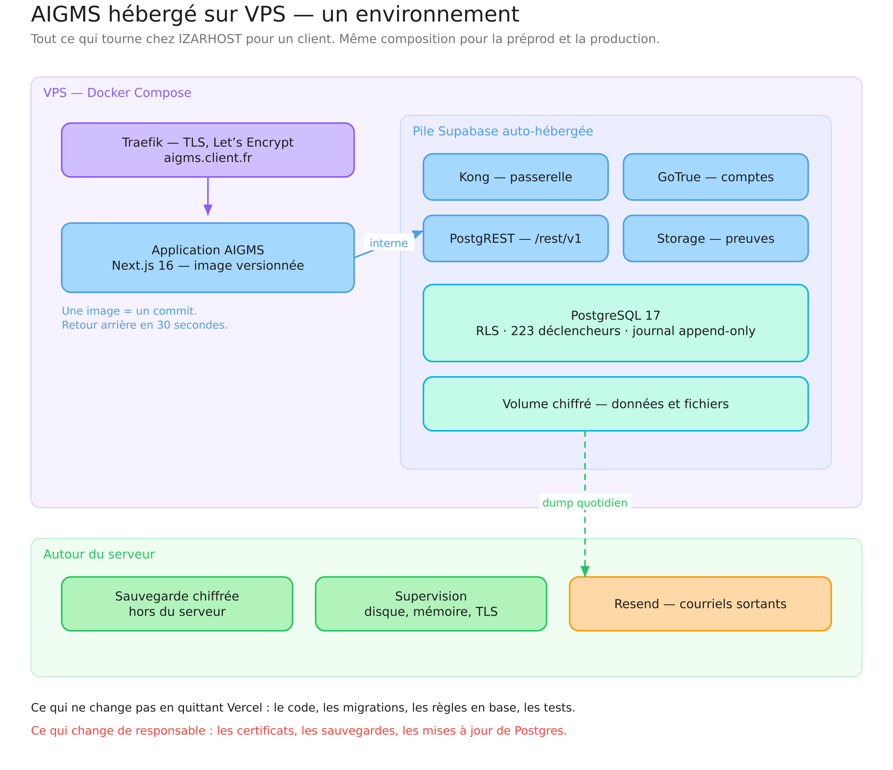
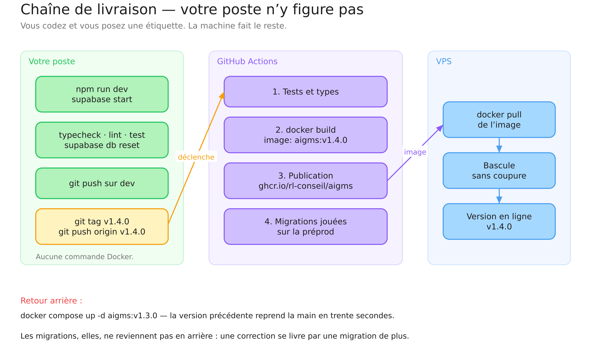
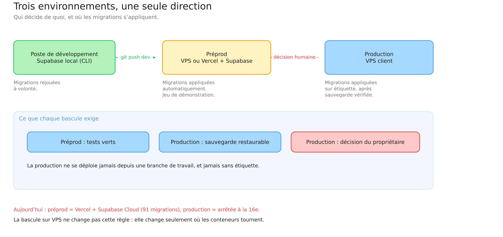
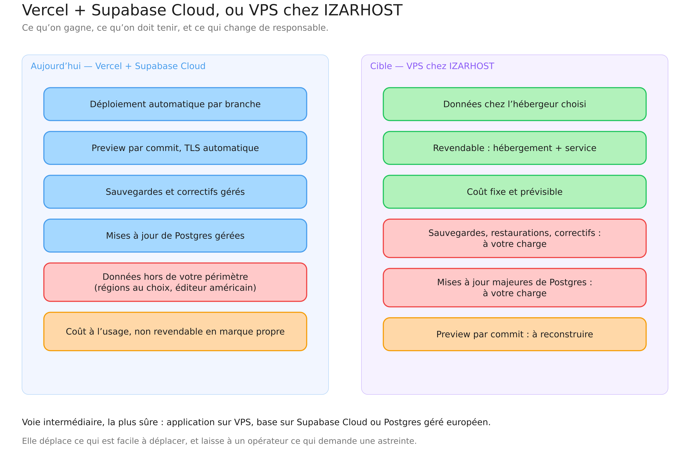

# Héberger AIGMS sur VPS — développement, livraison versionnée, exploitation

*Version 1 — 23 septembre 2026. Proposition d'architecture pour une
exploitation chez IZARHOST, en alternative à Vercel + supabase.com.*

---

## 1. Pourquoi la question se pose

Quatre raisons, dans l'ordre où elles pèsent :

1. **Revendre.** Un service managé de gouvernance de l'IA se vend mieux quand
   l'hébergement fait partie de l'offre. « Votre plateforme, chez votre
   infogéreur » est un argument ; « votre plateforme chez un éditeur
   américain » en est un autre, moins facile.
2. **Souveraineté.** AIGMS porte des registres de risques, des preuves, des
   décisions nominatives. Le client demandera où cela réside.
3. **Coût prévisible.** Un abonnement à l'usage devient difficile à annoncer
   quand on facture un forfait annuel par client.
4. **Maîtrise.** Un correctif urgent ne dépend plus d'un fournisseur.

En regard, une contrepartie qu'il faut nommer d'emblée : **ce qui est
aujourd'hui assuré par un éditeur devient votre astreinte.**

---

## 2. Ce que la plateforme exige réellement

Vérifié dans le code, pas supposé :

| Besoin | Réalité mesurée |
|---|---|
| Runtime applicatif | Next.js 16, Node 22. Aucune dépendance à une API Vercel |
| Base | PostgreSQL 17, 64 tables, 130 politiques RLS, 223 déclencheurs, 91 migrations |
| Services Supabase employés | **deux seulement** : l'authentification (`auth.getUser`) et le stockage de fichiers (8 usages). **Ni Realtime, ni Edge Functions, ni Vector** |
| Tâche planifiée | une route HTTP appelée chaque jour (`/api/alertes/envoi`), protégée par un secret |
| Courriel | Resend, par API — indépendant de l'hébergement |
| Taille de build | ~357 Mo (`.next`), image finale attendue autour de 250 Mo |

**Conclusion technique : la dépendance à l'hébergeur actuel est faible.** Ce
qui est propre à Vercel tient en trois éléments — le `vercel.json` de la tâche
planifiée, les variables d'environnement, et le script de déploiement. La
migration est un travail d'exploitation, pas une réécriture.

---

## 3. La cible d'exécution



*[Diagramme modifiable](https://excalidraw.com/#json=azpyNKHIz8aJDAPuz5e2k,tW8t0A08YlehO4-L3QB9FQ)*

### Composition

| Conteneur | Rôle |
|---|---|
| **Traefik** | terminaison TLS, certificat Let's Encrypt renouvelé seul, routage |
| **aigms** | l'application Next.js, image versionnée par commit |
| **kong** | passerelle Supabase : c'est elle qui expose `/rest/v1`, `/auth/v1`, `/storage/v1` |
| **postgrest** | l'API des registres, celle que n8n interroge |
| **gotrue** | comptes et jetons |
| **storage-api** | dépôt des preuves, sur volume local ou MinIO |
| **postgres** | PostgreSQL 17, le cœur : règles, RLS, journal |

### Dimensionnement

| Charge | vCPU | Mémoire | Disque |
|---|---:|---:|---:|
| Préprod ou démonstration | 2 | 4 Go | 40 Go |
| Production, 1 à 5 organisations | 4 | 8 Go | 80 Go |
| Production, 20 organisations | 4 | 16 Go | 160 Go |

La consommation vient de Postgres et du build, pas du trafic : AIGMS est une
plateforme de gouvernance, pas un site à forte audience. Quelques dizaines
d'utilisateurs simultanés par client, au plus.

### Réseau

Deux ports ouverts, 80 et 443. **Postgres n'est jamais exposé** : les
conteneurs se parlent sur un réseau interne. L'accès administrateur à la base
se fait par un tunnel SSH, jamais par une ouverture de port.

---

## 4. Docker : nécessaire, et où exactement

### Pour livrer : oui

- Next.js en mode `standalone` exige un Node précis et un ordre de variables
  au build ; une image **fige** cela et rend la livraison reproductible.
- **Le retour arrière devient trivial** : relancer l'image précédente prend
  trente secondes. Sans image, il faut reconstruire.
- **La traçabilité** : une image porte une étiquette qui porte un commit.
  « Quelle version tourne chez ce client ? » a une réponse exacte — ce qui
  compte pour une plateforme dont la valeur est l'auditabilité.
- La pile Supabase auto-hébergée **est** une composition de conteneurs. Ne pas
  utiliser Docker reviendrait à installer cinq services à la main sur chaque
  serveur.

### Pour développer : non, et c'est déconseillé

Votre poste tourne en `npm run dev` avec `supabase start`. C'est la bonne
méthode et il n'y a aucune raison d'en changer :

- le rechargement à chaud reste immédiat ;
- la machine, déjà lente, n'a pas à faire tourner un conteneur de plus ;
- il n'y a pas d'écart d'environnement à réconcilier entre plusieurs
  développeurs — vous êtes seul.

**À noter** : `supabase start` fait déjà tourner huit conteneurs Docker sur
votre poste (Postgres, PostgREST, GoTrue, Storage, Studio, Realtime, Mailpit,
pg-meta). Vous utilisez donc Docker **sans jamais taper une commande
Docker** — c'est exactement le rapport à garder avec lui.

### Obligatoire ? Non

Une livraison sans conteneur est possible : Node et PM2 sur le serveur,
Postgres installé par paquet. On y perd la reproductibilité, le retour arrière
immédiat et l'isolation. **Je le déconseille**, sans l'interdire.

---

## 5. La chaîne de livraison versionnée



*[Diagramme modifiable](https://excalidraw.com/#json=x8qP66ielXKzzZPUtMXmK,42qfHSBBRWDcue1Tx09JRw)*

### Ce que vous faites

Rien de nouveau au quotidien :

```bash
npm run typecheck && npm run lint && npm run test   # comme aujourd'hui
supabase db reset                                    # les migrations rejouées
git push origin dev                                  # la Preview se met à jour
```

Et, pour livrer :

```bash
git tag v1.4.0
git push origin v1.4.0
```

**C'est tout.** Aucune commande Docker, aucune connexion au serveur.

### Ce que la machine fait

L'étiquette déclenche un workflow GitHub Actions :

1. **Vérifier** — types, lint, tests unitaires, tests RLS contre une base
   jetable. Un échec arrête tout : aucune image n'est publiée.
2. **Construire** — `docker build`, sur une machine rapide, jamais la vôtre.
3. **Publier** — l'image part dans le dépôt privé de GitHub
   (`ghcr.io/rl-conseil/aigms:v1.4.0`), avec l'empreinte du commit.
4. **Déployer la préprod** — le VPS de préprod récupère l'image, applique les
   migrations, bascule.
5. **Attendre pour la production** — la bascule de production **n'est pas
   automatique** : elle se déclenche à la main, après sauvegarde vérifiée.

### Le retour arrière

```bash
# sur le serveur, ou par le workflow « rollback »
docker compose up -d aigms:v1.3.0
```

Trente secondes. **Mais les migrations ne reviennent pas en arrière** : une
correction de base se livre par une migration de plus, jamais par un retour.
C'est une règle qu'AIGMS applique déjà — 92 migrations, aucune réécrite.

### Ce qu'il reste à écrire

Le dépôt n'a **aucun workflow CI** aujourd'hui (`.github/workflows/` est
vide). Trois fichiers à créer :

| Fichier | Rôle |
|---|---|
| `Dockerfile` | construction en deux étapes, sortie `standalone`, utilisateur non privilégié |
| `docker-compose.yml` | la composition ci-dessus, une par environnement |
| `.github/workflows/livraison.yml` | vérifier, construire, publier, déployer |

Compter **deux à trois jours** pour les écrire et les éprouver.

---

## 6. Les environnements et qui décide



*[Diagramme modifiable](https://excalidraw.com/#json=6T5yvrth0UU-Br5k4Xuw-,kCmAQ_fbPhQjInrK3p5Tww)*

| Environnement | Base | Migrations | Qui décide |
|---|---|---|---|
| **Poste** | Supabase local (CLI) | rejouées à volonté (`db reset`) | vous |
| **Préprod** | VPS de préprod, ou Supabase Cloud pendant la transition | appliquées automatiquement à chaque étiquette | vous |
| **Production** | VPS du client | appliquées à la main, après sauvegarde vérifiée | **le propriétaire seul** |

La règle actuelle ne change pas : la production ne se déploie jamais depuis
une branche de travail, et jamais sans étiquette.

**Rappel d'état** : la production est aujourd'hui arrêtée à la migration 16,
la préprod en porte 92. La bascule vers le VPS **ne doit pas** servir à
rattraper ce retard en une fois : on bascule d'abord une préprod identique, on
vérifie, puis on traite la production comme une migration à part entière
(`docs/roadmap/MISE_EN_PRODUCTION.md`).

---

## 7. Ce que l'on perd en quittant Vercel

| Perdu | Ce qu'il faut reconstruire | Effort |
|---|---|---|
| Déploiement automatique par branche | le workflow GitHub Actions | inclus ci-dessus |
| **Preview par commit** | rien d'équivalent à coût raisonnable : un VPS de préprod par branche n'est pas tenable | **accepter la perte** |
| TLS automatique | Traefik + Let's Encrypt | une fois, dans la composition |
| Réseau de diffusion mondial | sans objet : les utilisateurs sont en France | — |
| Journal de build consultable | les journaux GitHub Actions | équivalent |

**La Preview par commit est la vraie perte.** C'est ce qui permet aujourd'hui
de montrer une branche avant de la fusionner. Deux parades : garder Vercel
pour `dev` uniquement (le coût est nul en offre gratuite) et n'utiliser le VPS
que pour ce qui est livré ; ou renoncer et valider sur la préprod.

**Je recommande la première** : Vercel pour la démonstration et le travail
quotidien, VPS pour les clients. Les deux cohabitent sans conflit.

---

## 8. Ce que l'on perd en quittant supabase.com — le point sérieux

C'est ici que l'engagement est lourd, et il faut le dire franchement.

| Assuré aujourd'hui par l'éditeur | Qui devient votre charge |
|---|---|
| Sauvegardes quotidiennes, restauration à un instant donné | dump quotidien chiffré, **et restauration testée** |
| Correctifs de sécurité de Postgres | veille et application |
| Mises à jour majeures (17 → 18) | planification, essai, bascule |
| Surveillance, alertes de saturation | à monter |
| Tableau de bord, éditeur SQL, visualiseur de journaux | Studio auto-hébergé, moins abouti |
| Réplique de lecture, bascule automatique | inexistant sans travail supplémentaire |

**Une sauvegarde jamais restaurée n'est pas une sauvegarde.** Pour une
plateforme dont la valeur *est* l'intégrité de ses registres et de son
journal, c'est l'engagement principal.

### La voie intermédiaire, que je recommande d'examiner



*[Diagramme modifiable](https://excalidraw.com/#json=vyjqto3FzjoMKc2KK94bF,4kNcazyME-4oJcD-tQLgNg)*

**Application sur VPS, base gérée par un opérateur** — Supabase Cloud, ou un
PostgreSQL géré européen (OVH, Scaleway, Clever Cloud) complété de PostgREST
et GoTrue en conteneurs. On déplace ce qui est facile à déplacer, on laisse à
un opérateur ce qui demande une astreinte de nuit.

| Critère | Tout Vercel/Supabase | Tout VPS | Mixte |
|---|---|---|---|
| Données en Europe | oui (région au choix) | oui | oui |
| Revendable en marque propre | non | **oui** | **oui** |
| Astreinte base de données | éditeur | **vous** | opérateur |
| Coût mensuel (1 client) | ~50 € | ~40 € | ~60 € |
| Coût mensuel (7 clients) | ~200 € | ~120 € | ~180 € |
| Effort de mise en place | — | 5 à 8 j | 3 à 4 j |

*Ordres de grandeur, à confirmer avec les tarifs d'IZARHOST.*

---

## 9. Sécurité et conformité

- **Chiffrement au repos** : volume chiffré (LUKS) ou disque chiffré de
  l'hébergeur. Les preuves y résident.
- **Secrets** : jamais dans l'image, jamais dans Git. Un fichier `.env` en
  droits `600`, ou un coffre. Les mêmes noms qu'aujourd'hui —
  `SUPABASE_SERVICE_ROLE_KEY`, `CRON_SECRET`, `RESEND_API_KEY`.
- **Accès administrateur** : SSH par clé seulement, pas de mot de passe, pas
  de root direct, journalisation des connexions.
- **Journal d'audit** : déjà *append-only* en base — un déclencheur refuse
  `UPDATE` et `DELETE`, y compris pour `service_role`. Ce comportement est
  identique sur VPS.
- **RGPD** : un hébergeur français simplifie le registre des traitements et
  les mentions de sous-traitance. C'est un argument commercial autant que
  juridique.
- **Cloisonnement des clients** : la plateforme est multi-tenant et la RLS le
  garantit. Un VPS par client reste possible pour un client qui l'exige —
  mais ce n'est **pas** nécessaire à la sécurité, c'est un choix commercial,
  et cela multiplie l'exploitation.

---

## 10. Plan de migration, réversible

| Étape | Contenu | Durée | Réversible |
|---|---|---|---|
| 1 | `Dockerfile`, `docker-compose.yml`, workflow de livraison | 2–3 j | oui |
| 2 | VPS de préprod, pile complète, restauration d'un dump de la préprod actuelle | 1 j | oui |
| 3 | Faire tourner les deux préprods en parallèle une à deux semaines | — | oui |
| 4 | Sauvegarde, restauration **testée**, supervision, astreinte définie | 1–2 j | — |
| 5 | Premier client sur VPS, la préprod Vercel restant en démonstration | 1 j | oui |

**À aucune étape on ne coupe l'existant.** Le retour en arrière consiste à
repointer un nom de domaine.

---

## 11. Ce que je déconseille

- **Basculer la production actuelle en même temps que l'hébergement.** Deux
  ruptures simultanées — 76 migrations et un changement d'hébergeur — rendent
  tout diagnostic impossible.
- **Auto-héberger la base sans astreinte définie.** Si personne n'est nommé
  pour restaurer un dimanche, l'auto-hébergement est un risque, pas une
  maîtrise.
- **Un VPS par client dès le départ.** Sept serveurs à tenir pour sept
  clients, quand la plateforme est multi-tenant et que la RLS est testée par
  293 tests, c'est une charge choisie sans bénéfice de sécurité.
- **Développer en conteneur.** Aucun bénéfice pour un développeur seul, un
  coût certain sur une machine lente.
- **Renoncer à Vercel tout de suite.** Il ne coûte rien pour la démonstration
  et rend la Preview par commit — laissez-le faire ce qu'il fait bien.

---

## 12. En une phrase

**Oui, AIGMS se déplace sur un VPS sans réécriture** — la dépendance mesurée à
l'hébergeur actuel est faible. **Docker est nécessaire pour livrer, inutile
pour développer**, et la construction se fait chez GitHub, jamais sur votre
poste. Le vrai engagement n'est pas technique, il est opérationnel :
**auto-héberger la base, c'est prendre l'astreinte des sauvegardes et des
restaurations** — d'où la voie intermédiaire proposée au §8.
