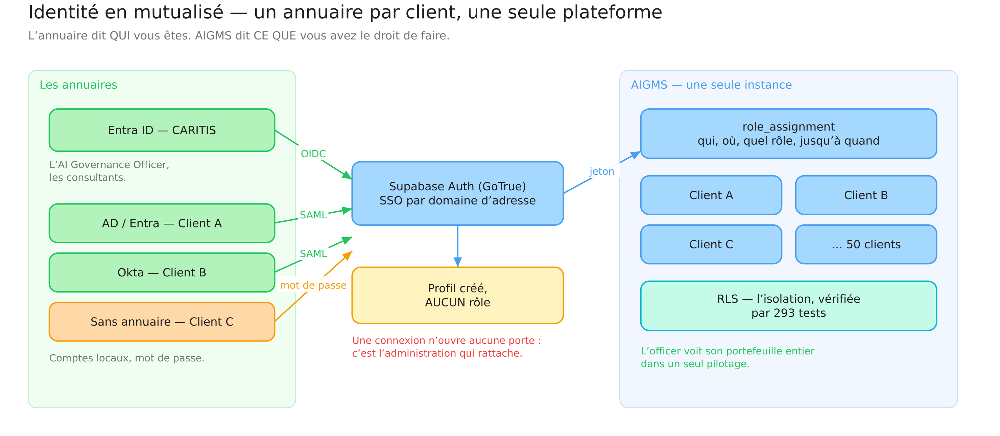
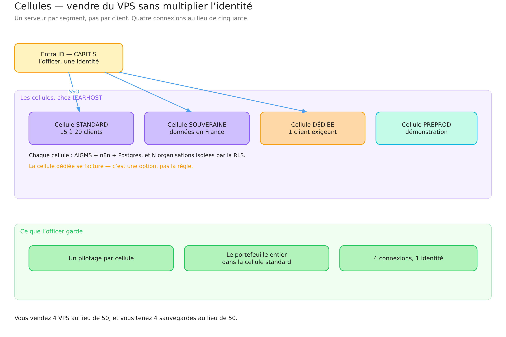
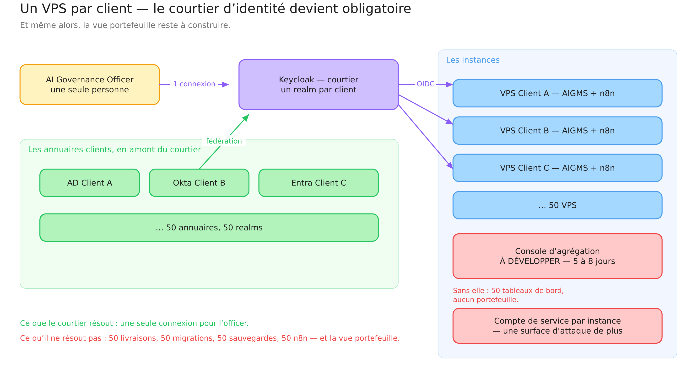

# Architecture d'identité — un annuaire par client, un officer, 40 à 50 comptes

*23 septembre 2026. Complément à `HEBERGEMENT_VPS_V1.md`.*

---

## 1. La question posée

> *Un VPS par client chez IZARRALDE, potentiellement 40 ou 50 clients ? Et le
> responsable AI Officer qui doit se connecter à ces 40 ou 50 comptes, avec
> 1 LDAP par client — quelle architecture d'identité ?*

Deux questions sont enchevêtrées, et il faut les séparer avant de répondre,
sous peine de résoudre la mauvaise :

1. **Combien d'instances ?** Une pour tous, quelques-unes, ou une par client.
2. **Combien d'identités pour l'officer ?** Une, ou une par client.

La seconde n'est pas commandée par la première. C'est le point central de ce
document.

---

## 2. Le constat qui change tout : un annuaire ≠ une instance

AIGMS sépare déjà, en base, deux choses que l'on confond souvent :

| Question | Qui y répond | Où cela vit |
|---|---|---|
| **Qui êtes-vous ?** | l'annuaire du client (Entra ID, AD, Okta, LDAP) | à l'extérieur d'AIGMS |
| **Que pouvez-vous faire, et où ?** | `role_assignment` | dans AIGMS |

Le déclencheur `on_auth_user_created` (migration 0002, `app.handle_new_auth_user`)
crée un profil à la première connexion — **avec aucun rôle**. Une connexion
réussie n'ouvre aucune porte tant que l'administration n'a pas posé une
affectation. C'est une décision d'architecture, pas un oubli : l'annuaire
atteste l'identité, AIGMS décide des droits.

Or Supabase Auth résout l'annuaire **par domaine d'adresse** :
`signInWithSSO({ domain })` envoie `marie@clientA.fr` vers l'IdP du client A et
`paul@clientB.com` vers celui du client B — sur **une seule instance**. Un
tenant Supabase accepte autant de fournisseurs SAML que l'on en déclare.

> **Cinquante annuaires ne réclament pas cinquante plateformes.** Ils
> réclament cinquante déclarations SAML sur la même plateforme.

---

## 3. Ce qu'une instance par client coûterait vraiment

Avant de choisir, il faut nommer ce qui se perdrait.

**Le pilotage disparaît.** `app.attention_by_organization()` (migration 0031)
énumère les organisations par `app.has_tenant_access(o.tenant_id)` : l'officer
voit, sur un seul écran, les actions en retard, les revues dues, les preuves
périmées, les incidents ouverts et les risques élevés de **tout son
portefeuille**. C'est ce qui rend tenable un modèle à 4 jours par an et par
client. Cinquante bases séparées, c'est cinquante tableaux de bord et zéro
portefeuille : il faudrait **reconstruire une console d'agrégation** (5 à
8 jours, plus son exploitation et sa surface d'attaque).

**L'exploitation est multipliée par cinquante.** Chaque version d'AIGMS, c'est
50 déploiements, 50 passages de migrations, 50 vérifications. Chaque correctif
de sécurité Postgres, c'est 50 fenêtres de maintenance. Chaque sauvegarde,
c'est 50 restaurations à répéter pour être crédible.

**Le coût.** Environ 40 €/mois par VPS capable de tenir AIGMS + Postgres +
n8n : **~2 000 €/mois** pour 50 clients, contre ~120 €/mois pour deux ou trois
cellules mutualisées. Cela vend du VPS ; cela consomme aussi le temps que vous
vendez.

**Ce que cela n'achète pas.** L'isolation existe déjà : RLS forcée sur toutes
les tables métier, 130 politiques, 293 tests. Un VPS par client ajoute une
frontière matérielle, pas une frontière logique qui manquerait.

---

## 4. Trois architectures

### A. Mutualisé — *recommandé*

*Diagramme Excalidraw : <https://excalidraw.com/#json=PgVPDXRq3XL4AZWADmTEZ,8ZfhMv7Brt_zPsrc-V68Ng>*

Une plateforme AIGMS. Un annuaire par client, déclaré en SAML sur le domaine
du client. L'officer et les consultants vivent dans l'Entra ID de CARITIS.

| Qui | Comment il se connecte |
|---|---|
| AI Governance Officer, consultants | OIDC « Microsoft » sur l'Entra ID de CARITIS — **une identité, une connexion** |
| Utilisateurs du client A | SAML, annuaire du client A, résolu par le domaine de l'adresse |
| Utilisateurs du client B | SAML, annuaire du client B |
| Client sans annuaire | compte local AIGMS, mot de passe, captcha |

**Ce que l'officer obtient.** Une connexion, un `/admin/pilotage` qui couvre
les 50 organisations, un basculement d'organisation sans se reconnecter.

**Pour n8n.** Une instance, et **un compte d'automatisation par organisation**
(pas un `service_role`) : chaque scénario n8n s'authentifie sur PostgREST avec
le compte de son organisation, et la RLS fait le reste. L'isolation des
automatisations est celle de la plateforme, vérifiée par les mêmes tests.

**Ce qui reste à développer.** Le bouton « Se connecter avec l'annuaire de mon
organisation » sur la mire (`src/app/login/page.tsx`) : une saisie d'adresse,
un `signInWithSSO({ domain })`. **Une demi-journée, aucune migration.**
Aujourd'hui, `signInWithSSO` n'apparaît nulle part dans `src/` — c'est le seul
manque.

**Ce qu'il faut acheter.** Le plan Supabase Pro (ou l'équivalent self-hosted)
pour SAML ; l'OIDC est disponible sur tous les plans.

**Le prérequis de gouvernance.** Chaque annuaire client doit avoir
« Assignment required = Yes » sur son application d'entreprise : un départ
dans l'annuaire du client coupe l'accès immédiatement, sans action d'AIGMS.

### B. Cellules — le compromis commercial

*Diagramme Excalidraw : <https://excalidraw.com/#json=gA_PdtVBaTG2djTJ1l9aa,D85psle7SM6G4azUTw81EA>*

Un VPS par **segment**, pas par client :

| Cellule | Contenu | Pour qui |
|---|---|---|
| STANDARD | AIGMS + Postgres + n8n, 15 à 20 organisations | la majorité |
| SOUVERAINE | idem, données en France, engagement contractuel | secteur public, santé |
| DÉDIÉE | idem, une seule organisation | le client qui l'exige — **et qui la paie** |
| PRÉPROD | démonstration, recette | CARITIS |

L'identité ne change pas : l'officer reste sur l'Entra ID de CARITIS, les
clients sur leur annuaire. Quatre connexions au lieu de cinquante, quatre
sauvegardes au lieu de cinquante. Vous vendez quand même du VPS à IZARRALDE —
quatre ou cinq, avec une marge et une exploitation tenable.

**La cellule dédiée devient une option tarifée**, pas la règle. C'est
exactement la position commerciale d'Iubenda, OneTrust ou Credo AI : mutualisé
par défaut, dédié au catalogue.

### C. Un VPS par client — si c'est imposé

*Diagramme Excalidraw : <https://excalidraw.com/#json=kaOP5w4HyBT4nd7Z_nuaY,utyD9HcV-ukLzoX7bFagWw>*

Si un client ou un appel d'offres impose l'instance dédiée, l'identité **exige
un courtier**. Sans lui, l'officer gère 50 mots de passe : intenable et
insauvegardable.

**Keycloak comme courtier d'identité (identity broker)**, hébergé une fois chez
IZARHOST :

1. **Un realm par client.** Dans chaque realm, l'annuaire du client est déclaré
   en amont (*identity provider* SAML/OIDC, ou fédération LDAP directe pour un
   AD classique).
2. **Chaque instance AIGMS est un *relying party* OIDC** de son realm. Côté
   Supabase self-hosted de l'instance : un fournisseur OIDC générique pointant
   sur `https://sso.caritis.eu/realms/<client>`.
3. **L'officer a une identité unique** dans un realm CARITIS, déclarée comme
   IdP amont de chaque realm client. Il se connecte une fois ; les 50 instances
   le reconnaissent.
4. **n8n** consomme le même courtier (OIDC natif), ou reste sur ses comptes
   d'automatisation.

**Ce que le courtier résout :** une connexion, un annuaire de secours, une
révocation centrale, une trace de connexion unique.

**Ce qu'il ne résout pas :** 50 livraisons, 50 migrations, 50 jeux de
sauvegardes, 50 n8n — et surtout **pas la vue portefeuille**, qui reste à
construire.

**Ce que cela ajoute au devis :** le VPS Keycloak (~20 €/mois), son
exploitation, un certificat par realm à renouveler, et la console
d'agrégation (5 à 8 jours de développement, puis maintenance).

---

## 5. Comparaison

| | A. Mutualisé | B. Cellules | C. Un VPS par client |
|---|---|---|---|
| Connexions pour l'officer | 1 | 1 | 1 (avec courtier), 50 sans |
| VPS à tenir | 1 | 4 à 5 | 50 |
| Coût d'infrastructure / mois | ~60 € | ~120 € | ~2 000 € (+ courtier) |
| Déploiements par version | 1 | 4 à 5 | 50 |
| Vue portefeuille `/admin/pilotage` | native | native par cellule | **à développer (5-8 j)** |
| Développement d'identité requis | bouton SSO (½ j) | bouton SSO (½ j) | bouton SSO + Keycloak + console |
| Isolation | RLS (130 politiques, 293 tests) | RLS | RLS + machine |
| Argument commercial « dédié » | option tarifée | segment SOUVERAIN / DÉDIÉ | par défaut |
| Surface d'attaque | 1 plateforme | 4 à 5 | 50 + le courtier |

---

## 6. Comment un client arrive — la procédure

Quel que soit le scénario retenu, la séquence d'accueil ne change pas :

1. **La DSI du client déclare AIGMS** dans son annuaire : application
   d'entreprise SAML, `Entity ID` et `Reply URL` du projet Supabase, claims
   `email` et `name`, « Assignment required = Yes ».
2. **CARITIS déclare le domaine** côté Supabase :
   `supabase sso add --type saml --metadata-url '<métadonnées du client>'
   --domains client.fr`.
3. **Les personnes se connectent** — un profil se crée, **sans rôle**.
4. **L'administration pose les six rôles** (migration 0056 : une organisation
   n'est opérationnelle qu'avec ses six rôles tenus), plus l'`client_admin` si
   le client administre ses propres comptes.
5. **Le départ d'une personne** se traite dans l'annuaire du client (accès
   coupé) et dans AIGMS (`valid_until = now()` sur l'affectation — jamais de
   suppression, le journal garde qui a eu quel rôle et quand).

---

## 7. Le provisionnement automatique des rôles — ce qui viendrait ensuite

Les trois scénarios laissent l'étape 4 manuelle. Pour l'automatiser, le
niveau C de `docs/admin/COMPTES_ET_ANNUAIRE.md` reste valide et **ne dépend pas
du scénario d'hébergement** :

- une convention de groupes dans l'annuaire, `AIGMS-<organisation>-<rôle>` ;
- une table `directory_group_mapping` (groupe → organisation, rôle),
  administrée depuis Connecteurs, journalisée ;
- une synchronisation par Microsoft Graph, déclenchée à la main et par tâche
  planifiée ;
- des garde-fous : ne jamais toucher `platform_admin`, refuser de laisser une
  organisation sans AI Governance Officer, rendre compte dans le journal.

Ordre de grandeur : une migration, une action serveur, un écran. À faire quand
le nombre de clients le justifie — pas avant.

---

## 8. Recommandation

**Mutualisé par défaut, dédié comme option tarifée.**

Concrètement, ce que je propose de dire à IZARRALDE :

- **deux VPS au départ** (une cellule STANDARD, une PRÉPROD), plutôt qu'un par
  client — le revenu d'hébergement se construit sur la croissance des cellules,
  pas sur leur multiplication ;
- **une cellule SOUVERAINE** dès qu'un client public ou santé le demande, ce
  qui est un vrai argument de vente et un troisième VPS ;
- **une cellule DÉDIÉE au catalogue**, facturée, pour le client qui l'exige ;
- **Keycloak seulement si le dédié devient la règle** — et dans ce cas, chiffrer
  aussi la console d'agrégation, sans quoi le service à 4 jours/an/client ne
  tient plus.

Le seul développement que cette architecture réclame aujourd'hui est **le
bouton « Se connecter avec l'annuaire de mon organisation »** : une demi-journée,
sans migration. Tout le reste est de la configuration.

---

## 9. En une phrase

**Un annuaire par client n'impose pas une instance par client** : Supabase
résout l'IdP par domaine d'adresse, et AIGMS sépare déjà l'identité (l'annuaire)
de l'autorisation (`role_assignment`). Multiplier les instances multiplie
l'exploitation, le coût et la surface d'attaque — et **détruit le pilotage de
portefeuille qui fait tenir le modèle de service**.
