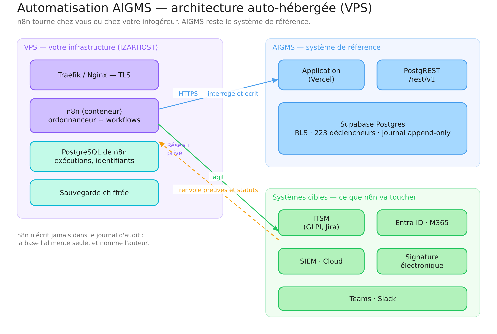
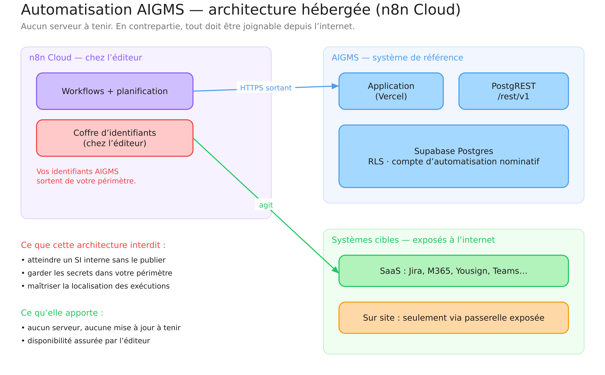
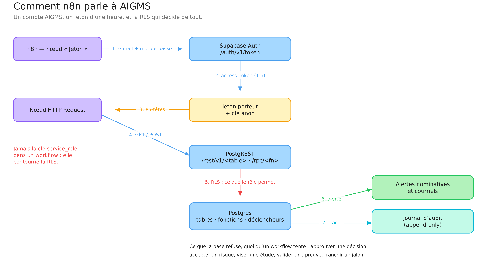
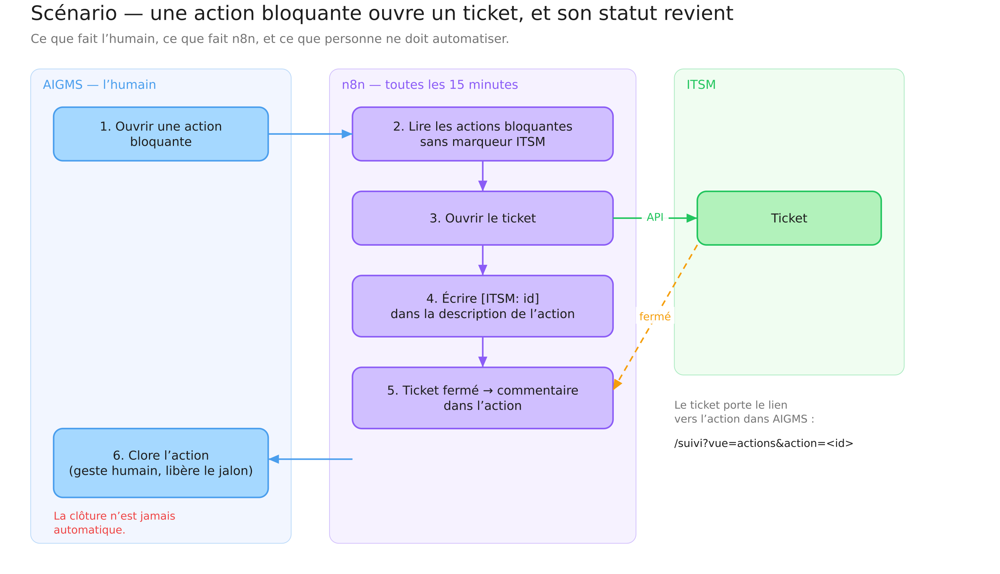

# Architecture d'automatisation AIGMS — VPS ou hébergée

*Version 1 — 23 septembre 2026. Complément d'architecture au
[guide n8n](./GUIDE_N8N_V1.md), qui décrit les scénarios pas à pas.*

---

## 1. Le principe, avant les schémas

AIGMS reste le **système de référence** : il porte le registre, les risques,
les contrôles, les preuves, les décisions, et il applique ses règles en base —
223 déclencheurs, une journalisation qui ne se réécrit pas. L'orchestrateur ne
gouverne rien : il **transporte** l'information et **agit sur d'autres
systèmes**, puis rapporte.

Trois phrases valent pour les deux architectures :

1. **n8n interroge, AIGMS n'émet rien.** Il n'existe pas de webhook sortant :
   tout repose sur une lecture périodique (15 minutes est le bon compromis).
2. **n8n a son propre compte AIGMS**, avec un rôle de gouvernance minimal. Ses
   écritures sont nominatives au journal d'audit.
3. **La clé `service_role` n'entre jamais dans un workflow.** Elle contourne
   la sécurité par ligne ; le compte et la RLS suffisent.

---

## 2. Architecture auto-hébergée (VPS)



*Source modifiable : [Excalidraw](https://excalidraw.com/#json=bfAwftqTnwtlF4LCtnJ5M,PWkEu4SZBcXRJukPl4SOlg) ·
fichier `images/01-architecture-vps.excalidraw`*

### Ce que porte le serveur

| Composant | Rôle | Remarque |
|---|---|---|
| **Traefik** ou **Nginx** | terminaison TLS, certificat Let's Encrypt | n8n ne doit jamais être exposé en clair |
| **n8n** (conteneur) | ordonnanceur et workflows | une seule instance suffit jusqu'à quelques milliers d'exécutions par jour |
| **PostgreSQL de n8n** | exécutions, identifiants chiffrés | **distinct** de la base AIGMS : ne jamais les mélanger |
| **Sauvegarde chiffrée** | workflows, identifiants, historique | la perte des identifiants oblige à tout reconstruire |

### Dimensionnement

2 vCPU, 4 Go de mémoire, 40 Go de disque suffisent pour les cinq scénarios du
guide. La consommation vient des exécutions concurrentes, pas du volume
AIGMS : les requêtes rendent quelques dizaines de lignes.

### Ce que cette architecture apporte

- **Les secrets restent chez vous** : le mot de passe du compte
  d'automatisation, les jetons ITSM, les clés M365 ne quittent pas votre
  périmètre.
- **L'accès au réseau interne** : un ITSM sur site, un annuaire, un partage
  de fichiers sont joignables sans être publiés sur l'internet.
- **La localisation des traitements** est connue et contractualisable — ce qui
  compte quand les workflows manipulent des données de gouvernance.

### Ce qu'elle coûte

Un serveur à tenir : mises à jour de n8n, du système, du certificat ;
surveillance ; sauvegarde vérifiée. C'est exactement le genre de charge que
porte un infogéreur comme IZARHOST.

---

## 3. Architecture hébergée (n8n Cloud)



*Source modifiable : [Excalidraw](https://excalidraw.com/#json=qnistroUM16HLHNJOvQKh,JFzDp_YCW2o87WUGYxq8bg) ·
fichier `images/02-architecture-hebergee.excalidraw`*

### Ce qui change

| Point | Conséquence |
|---|---|
| **Les identifiants vivent chez l'éditeur** | le mot de passe du compte d'automatisation AIGMS sort de votre périmètre. À arbitrer explicitement, et à consigner comme dépendance fournisseur dans AIGMS lui-même |
| **Aucun accès au réseau interne** | un ITSM sur site n'est joignable que s'il est publié : passerelle, VPN sortant, ou renoncement |
| **Localisation des exécutions** | déterminée par l'offre, rarement choisie |
| **Rien à tenir** | pas de mise à jour, pas de certificat, disponibilité assurée |

### Quand la choisir

Quand tous les systèmes cibles sont eux-mêmes en SaaS — Jira Cloud,
Microsoft 365, Yousign, Teams — et qu'aucune remédiation ne touche un système
interne. C'est le cas d'un premier périmètre de démonstration.

### Le réflexe de gouvernance

Si vous retenez cette architecture, **déclarez n8n Cloud comme fournisseur
dans AIGMS** et conduisez sa revue : DPA, localisation, sous-traitants,
réversibilité. Un outil qui détient un compte de gouvernance est un tiers
impliqué au sens du registre — et sa revue devient une précondition de
production pour les cas d'usage qui en dépendent.

---

## 4. Comparaison, pour trancher

| Critère | VPS | Hébergée |
|---|---|---|
| Secrets dans votre périmètre | ✅ | ❌ |
| Accès à un SI interne | ✅ | ❌ sauf publication |
| Charge d'exploitation | à porter | nulle |
| Délai de mise en service | 1 à 2 jours | 1 heure |
| Coût direct | serveur + exploitation | abonnement |
| Convient à une démonstration | oui | **oui, c'est le plus rapide** |
| Convient à une remédiation sur SI interne | **oui** | non |

**Recommandation** : commencer en hébergé pour les scénarios de lecture et de
notification (4 et 5 du guide), basculer sur VPS dès qu'un scénario touche un
système interne ou manipule des preuves sensibles (1, 2 et 3).

---

## 5. Comment n8n parle à AIGMS



*Source modifiable : [Excalidraw](https://excalidraw.com/#json=jAbMKz8D_hSneRzlR1WNA,4kaV937l6BuMNZK2nOyzSg) ·
fichier `images/03-authentification.excalidraw`*

La chaîne, en sept temps :

1. Le nœud « Jeton » présente l'e-mail et le mot de passe du compte
   d'automatisation à `POST /auth/v1/token?grant_type=password`.
2. Supabase Auth rend un `access_token` valable **une heure**.
3. Les nœuds suivants portent deux en-têtes : `apikey` (la clé publique
   `anon`) et `Authorization: Bearer <jeton>`.
4. Les appels vont à PostgREST : `/rest/v1/<table>` pour les registres,
   `/rest/v1/rpc/<fonction>` pour ce que la plateforme sait calculer.
5. **La RLS décide** : le compte ne voit et n'écrit que ce que son rôle
   permet. Un workflow trop ambitieux reçoit une erreur, pas un résultat
   partiel silencieux.
6. Les déclencheurs en base produisent leurs effets : alertes nominatives,
   courriels, actions ouvertes.
7. Le journal d'audit enregistre l'écriture, avec l'auteur et l'heure.

Ce que la base refuse, quoi qu'un workflow tente : approuver une décision,
accepter un risque, viser une étude d'impact, valider une preuve, franchir un
jalon. Ces actes sont nominatifs, et c'est la raison d'être de la plateforme.

---

## 6. Un scénario de bout en bout



*Source modifiable : [Excalidraw](https://excalidraw.com/#json=3NrRivl-_TV2jkck8Nutj,5RfDUZHkX8p3lZYLHFr7sg) ·
fichier `images/04-scenario-action-ticket.excalidraw`*

Le partage des rôles se lit d'un coup d'œil : l'humain ouvre l'action et la
clôt ; n8n ouvre le ticket, marque l'action, rapporte la fermeture. **La
clôture n'est jamais automatique** — elle lève une précondition de mise en
production, elle se décide.

Le détail des nœuds figure au [guide](./GUIDE_N8N_V1.md#scénario-1--une-action-bloquante-ouvre-un-ticket-itsm-et-son-statut-revient).

---

## Annexe A — Mise en service d'un VPS

```bash
# 1. Un utilisateur dédié, jamais root
adduser n8n && usermod -aG docker n8n

# 2. docker-compose.yml, dans /opt/n8n
#    - n8n:latest, N8N_ENCRYPTION_KEY fixé (sans lui, les identifiants sont perdus au redémarrage)
#    - postgres:16 pour n8n, volume persistant
#    - traefik pour le TLS

# 3. Variables d'environnement de n8n
N8N_HOST=n8n.votre-domaine.fr
N8N_PROTOCOL=https
N8N_ENCRYPTION_KEY=<32 octets aléatoires, sauvegardés hors serveur>
WEBHOOK_URL=https://n8n.votre-domaine.fr/
GENERIC_TIMEZONE=Europe/Paris
DB_TYPE=postgresdb
DB_POSTGRESDB_HOST=postgres
# … identifiants de la base n8n

# 4. Pare-feu : 80 et 443 seulement
ufw allow 80,443/tcp && ufw enable

# 5. Sauvegarde quotidienne chiffrée du volume Postgres et de /opt/n8n
```

**Trois pièges** :
- `N8N_ENCRYPTION_KEY` non fixée : tous les identifiants deviennent illisibles
  au premier redémarrage ;
- SQLite par défaut : tient un temps, puis se corrompt sous charge — poser
  Postgres dès le départ ;
- sauvegarde non vérifiée : une restauration jamais essayée n'est pas une
  sauvegarde.

---

## Annexe B — Les variables à poser dans n8n

| Variable | Valeur | Où la trouver |
|---|---|---|
| `AIGMS_URL` | `https://<ref>.supabase.co` | Supabase → Project Settings → API |
| `AIGMS_ANON_KEY` | clé `anon` (publique) | idem |
| `AIGMS_APP` | `https://demo.aigms.eu` ou l'URL de production | — |

Le mot de passe du compte d'automatisation va dans les **Credentials** de n8n,
jamais dans un nœud ni dans une variable d'environnement.

---

## Annexe C — Ce que l'architecture ne résout pas

**L'absence de webhook sortant.** Quelle que soit l'architecture, n8n
interroge. Les ordres de grandeur :

| Période | Latence moyenne | Appels par jour et par workflow |
|---|---|---|
| 5 minutes | 2,5 min | 288 |
| **15 minutes** | 7,5 min | **96** — recommandé |
| 1 heure | 30 min | 24 |

Pour l'urgence, AIGMS envoie déjà un **courriel immédiat** (arrêt d'urgence
recommandé, incident à qualifier, décision qui retient un jalon, criticité
dépassée, preuve échue). n8n n'est pas le canal d'urgence.

Une à deux journées de développement — une table `webhook_endpoint` et une
expédition depuis la route planifiée existante — transformeraient
l'interrogation en événement. C'est une décision de feuille de route.

---

## Annexe D — Les sources des diagrammes

Les quatre diagrammes sont versionnés dans `docs/automatisation/images/` sous
trois formes : `.excalidraw` (modifiable), `.svg` (vectoriel) et `.png` (pour
Word). Ils se régénèrent d'une commande :

```bash
node scripts/diagrammes-n8n.mjs
```

Le script porte la définition des quatre schémas ; modifier un libellé se fait
là, pas dans l'image. Les liens Excalidraw ci-dessus pointent vers des copies
téléversées : les reprendre dans l'espace de travail CARITIS depuis
*Fichier → Enregistrer dans…* si vous voulez les ranger dans la collection
AIGMS.
